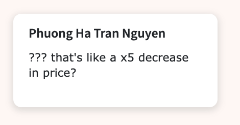

# **Title:** ⚠️ Urgent Github PR Request: Add features to release more personal information about Ha 

**Description:** This pull request proposes the addition of a new feature that allows Ha to voluntarily generate more of her life information into the system. Since Ha hasn't responded on Notion or wherever while Esther has been posting about her life on Substack, this feature aims to reduce information asymmetry between the two. This feature needs to be pushed to production ASAP because the user is missing out too many important updates.

**Features**

- Consistent information Input: Ha needs to find a way to consistently output information about her life and thoughts asynchronously. Nowadays, Esther only knows about Ha through this. Although she can roughly guess that Ha is surprised about money, it provides no context about Ha's life.
    
    
    
- Easy to integrate: Esther’s doesn’t want to add stress for Ha, so she encourage Ha to find a way that can easily integrate in her life without burden. Since Ha is a competent software engineer, we believe this feature request shouldn’t be too hard for her too build.
- Monitor with dashboards: The "Ha’s Input Rate" feature in our monitoring dashboard is a sophisticated tool designed to provide real-time insights into the rate at which Ha’s data is entered into the system. This feature is essential for administrators, data analysts, and IT professionals who need to track and manage the flow of data effectively.

    
    
    

**Implementation strategy**

- Lead Decision-Making: Ha will spearhead the decision-making process for the implementation strategy. This includes determining the key steps, timelines, and resource allocation necessary to bring the project to fruition.

- Team Collaboration: Ha is encouraged to collaborate with Esther for additional support and brainstorm. Esther's insights and skills will be invaluable in areas requiring specialized knowledge or a unique perspective.

